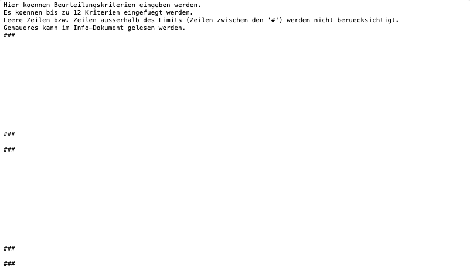

# Bewertungsbogen<br>Bedienungsanleitung

## Inhalt
1. Einführung
2. Installation
3. Benutzung
4. Sonstiges


## Einführung
Diese Software ermöglicht die Erstellung von Bewertungszetteln auf Basis von Benutzer- und predefinierten Kriterien. Diese werden im Browser geöffnet und können dann einfach als ```.pdf```-Datei abgespeichert werden oder ausgedruckt werden.
<br>
<br>
Die Software nutzt die Programmiersprache Python, der Quellcode befindet sich im ```source```-Ordner. Für Windows-Betriebssysteme gibt es eine ```.exe```-Datei, diese finden Sie im ```source/exe```-Ordner. Für die Python-Installation werden Module benötigt, dazu später mehr.

## Installation
### Python-Installation
<b>Dies ist die Installationsanleitung für die
Version des Programmes in Python. Falls Sie ein
Windows-System verwenden, wird die Verwendung der ```.exe```-Version empfohlen (Anleitung weiter unten).</b>

*Schritt 1:* Installieren Sie Python:
Laden Sie die neueste Vollversion für Ihr Betriebssystem [hier](https://www.python.org/downloads/) herunter und installieren Sie dieses.

*Schritt 2:* Installieren Sie das erforderliche Modul: Das Programm ```Bewertungsbogen``` erfordert <u>eine</u> externe Library. Diese Installieren Sie folgendermaßen:<br>
<b>a. Windows-Betriebssysteme:</b>
1. Öffnen Sie die Eingabeaufforderung mit<br> ```Windows-Taste + R``` und der Eingabe von ```cmd``` im geöffneten Fenster.
2. Geben Sie den folgenden Befehl ein:<br>
```py -m pip install pillow```
3. Drücken Sie die Eingabetaste.
4. Warten Sie, bis die Installation abgeschlossen ist.<br>

<b>b. MacOS oder andere:</b>
1. Öffnen Sie das Terminal (Zu finden im Ordner ```Programme/Dienstprogramme```)
2. Geben Sie den folgenden Befehl ein:<br>
```pip install pillow```
3. Drücken Sie die Eingabetaste.
4. Warten Sie, bis die Installation abgeschlossen ist.<br>

*Schritt 3:* Wählen Sie die entsprechende Version von ```Bewertungsbogen``` für Ihr System aus. <br>Für Windows-Betriebssysteme wählen Sie aus der Repository ```release/<neueste Version>/Bewertungsbogen 3.0.0 Python ZIP-Download``` aus und laden die ```.zip```-Datei herunter. Dann entpacken Sie die Datei im Explorer.<br><br>
Falls Sie ein MacOS oder ein anderes Betriebssystem verwenden, wählen Sie ```release/<neueste Version>/Bewertungsbogen 3.0.0 Python ZIP-Download``` aus und laden die ```.zip```-Datei herunter und entpacken diese ebenfalls.

### Windows-Executable-Installation
<b>Dies ist die Installationsanleitung für die Windows-Executable-Version (```.exe```-Datei). Diese Version benötigt keine externen Installationen, läuft aber nur unter Windows.</b>

*Schritt 1:* Laden Sie die
```.zip```-Datei der Windows-Executable-Version herunter. Diese finden Sie im Ordner ```release/<neueste Version>/Bewertungsbogen 3.0.0 Windows Executable ZIP-Download```.<br><br>
*Schritt 2:* Entpacken Sie die ```.zip```-Datei. Sie sollten folgenden Inhalt vorfinden:
<br>
* ```Bewertungsbogen 3.0.0.exe```
* ```_internal``` (Ordner mit wichtien Programmdateien, keinesfalls verändern!)
* ```license.md``` (Die Softwarelizenz)
* ```readme.md```(Die Betriebsanleitung)
* ```errorcodes.md```(Fehlercodes und ihre Beschreibung)

## Benutzung
### Start
<b>Für Windows-Exectuble:</b>
1. Doppelklicken Sie auf die ```.exe```-Datei

<b>Für Python-Skripte:</b>
1. Führen Sie einen Rechtsklick auf die ```.py```-Datei aus
2. Wählen Sie ```Öffnen mit``` im Kontextmenü aus und wählen dann ```Python Launcher``` (MacOS) oder ```Python``` (Windows) aus.

<i>Hinweis: Bei Starten des Python-Skripts erscheinen unter Umständen mehrere Fenster, die die Arbeit mit dem Programm stören könnten. Dies beheben Sie, in dem sie in diesen Fenstern nach einem Fenster mit dem Titel ```Preferences``` suchen. In diesem entfernen Sie dann das Häckchen bei: ```Run in a terminal window```. Nach einem Neustart des Programmes sind die Fenster dann verschwunden.</i>

### Aufbau und Funktionen:
Das sich geöffnete Fenster besteht aus drei Teilen:

* Namenseingabe und Eingabe von Generellen Werten
* Slider zum Anpassen der Beurteilung
* Einstellungen

#### Namenseingabe und Eingabe von Generellen Werten:
Hier können Sie den Namen der/des zu bewertenden Schüler/in eintragen. Dafür tragen Sie diesen in das Textfeld ein. 

Direkt darunter befindet sich die Schaltfläche, mit dem der Bewertungsbogen generiert wird.

Die darunter liegende Option öffnet ein Dialogfenster, in dem Sie:

*  Name der Arbeit (z.B. "1. Deutschschularbeit")
*  Datum der Arbeit
*  Klasse
*  Lehrperson

eingeben können.

#### Slider zum Anpassen der Beurteilung
Hier befinden sich insgesamt 12 Slider (auf Deutsch Schieberegler), mit denen Sie die Bewertung für jede Beurteilungskriterie ändern können. Beim Start zeigen diese allesamt ```Keine Bewertungskriterie ausgewählt``` an.
Sie können jeden dieser Slider in insgesamt 6 verschiedene Positionen ziehen:

* 0 - Die Kriterie wird nicht angezeigt
* 1 - Sehr gut gelungen
* 2 - Gut gelungen
* 3 - Befriedigend gelungen
* 4 - Wenig gelungen
* 5 - Nicht gelungen

Darunter haben Sie ein Dropdown-Menü und die Schaltfläche ```Aktualisieren```. Hierzu noch mehr später.

#### Einstellungen
Dies öffnet ein Dialogfenster mit Optionen.

### Verwendung
#### Importieren von Kriterien
Um Beurteilungskriterien in das Programm zu importieren, öffnen Sie zunächst das ```Einstellungen```-Fenster mit der Schaltfläche ganz unten im Hauptfenster. Hier klicken Sie nun auf ```Kriterien-Speicherung neu erstellen```.

Nun navigieren Sie im Dateimanage Ihres Computers (```Finder``` unter MacOS, ```Explorer``` unter Windows) zum Ordner, aus dem Sie das Programm gestartet haben. Dort befindet sich nun eine neue Datei, ```Kriterien-Speicherung.txt```. Diese Datei können Sie nun doppelklicken, um diese in einem Texteditor zu öffnen. Die Datei sollte in etwa so aussehen:



Zwischen den ```###``` können Sie nun Ihre Kriterien (z.B. Rechtsschreibung, Satzzeichensetzung) eingeben. **Wichtig: Beachten Sie, dass Sie die Zeilen nicht verschieben. Benutzen Sie die Pfeiltasten anstatt der Eingabetaste (Enter)!** Sie können bis zu zwölf Mal jeweils zwölf verschiedene Kriterien in das Dokument  eingeben.

Danach speichern Sie das Dokument mittels ```Strg-S``` ab und welchseln zurück ins Programm.

Klicken Sie nun auf ```Aktualisieren``` und Ihre Kriterien sollten im Programm erscheinen. Mit dem Dropdown-Menü können Sie zwischen den zwölf Kategorie-Eingabestellen im Dokument wechseln.

#### Eingabe von Schularbeit, Datum, etc.
Um Schularbeit, Datum, Klasse und Name der Lehrperson einzugeben, klicken Sie auf die Schaltfläche ```Generelle Einstellungen/Werte ändern```. Nun öffnet sich ein Fenster, in dem Sie die Werte in die Textfelder eingeben können. Klicken Sie nun auf ```Speichern``` und Ihre Eingabe bleiben nun für die gesamte Session (Solange das Programm offen ist) gespeichert.

#### Eingabe des Namens der zu bewertenden Person
Um den Namen der zu bewertenden Person einzugeben, tragen Sie diesen in das Textfeld über dem ```Dokument erstellen```-Schalter ein.

#### Kriterien bewerten
Um die Kriterien zu bewerten, ziehen Sie nun die Slider auf die gewünschte Note. 0 zeigt die jeweilige Kriterie nicht an,
die anderen Werte setzen die Bewertung auf das jeweilige Textequivalent zur Zahl.

*Beispiel: 1 = Sehr gut gelungen, 2 = Gut gelungen, etc.*

## Sonstiges
### Fehler und sonstiges unerwartetes Verhalten
Sollte das Programm einen Fehler feststellen, wird Ihnen ein Fehlercode angezeigt. Diesen Code können Sie im Dokument ```errorcodes.md``` nachschlagen, welches sich im Ordner ```docs``` befindet. 

Falls ein Fehler immer wieder auftritt und Sie keine Lösung finden, kontaktieren Sie mich gerne unter ```contact@tk-dev-software.com```.

### Lizenz und Information
Dieses Programm ist unter der MIT-Lizenz
veröffentlicht. Das bedeutet, dass Sie das Programm kostenlos verwenden und teilen können. Sie müssen eine Kopie der ```license.md``` immer inkludieren.

**Copyright (c) 2024 Annabeth Kisling<br>
Lizenz: MIT-Lizenz**


# tk_dev - Software with passion!

